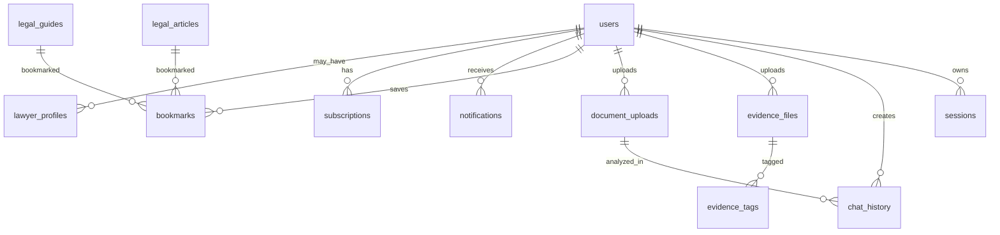

# 3. Database Schema

## ERD

## SQL schema

The canonical executable schema is in `backend/alembic/versions/0001_initial_nyayaai.py`. Tables include `users`, `sessions`, `chat_history`, `legal_articles`, `legal_guides`, `legal_templates`, `evidence_files`, `evidence_tags`, `document_uploads`, `bookmarks`, `notifications`, `subscriptions`, and `lawyer_profiles`.

## Design notes

- All tables use UUID primary keys.
- Sensitive uploads are stored in S3-compatible object storage; the database stores metadata and encrypted object references.
- `chat_history.sources` stores structured citation metadata.
- `legal_articles.search_vector` and `legal_guides.search_vector` are reserved for PostgreSQL full-text indexes.
- Audit timestamps are present on mutable records.
